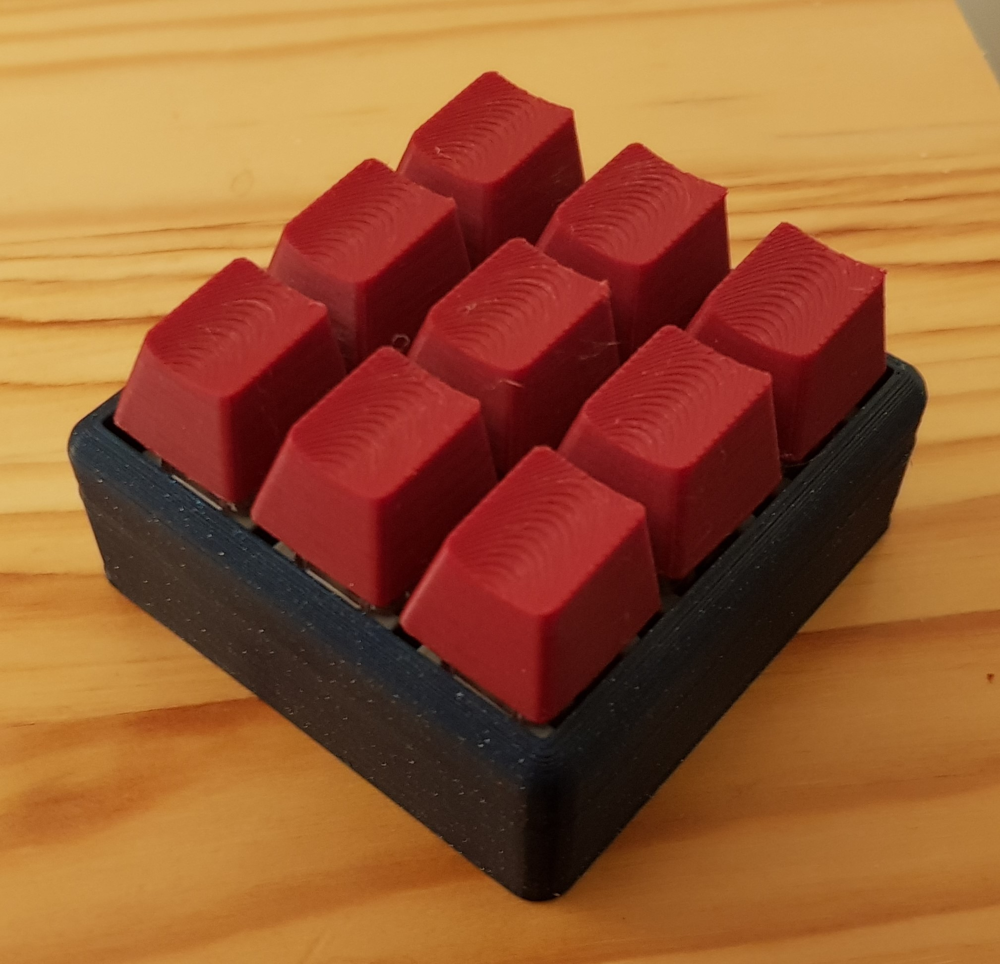
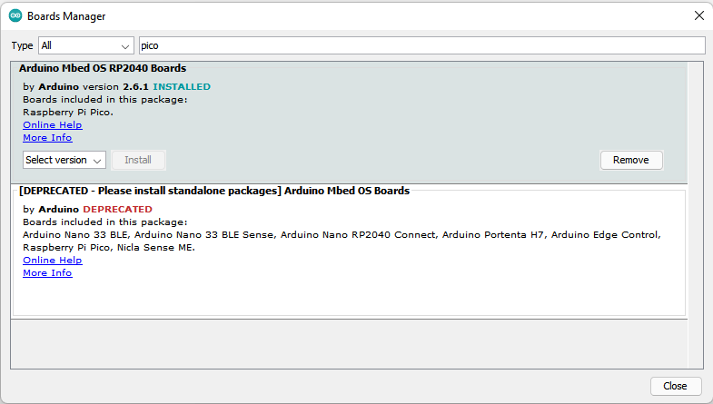
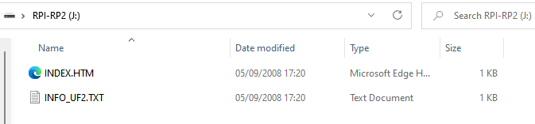
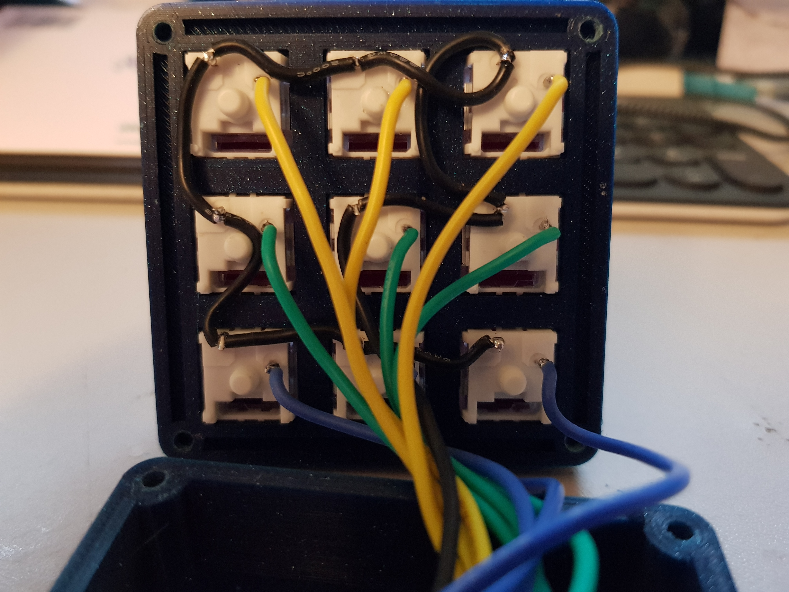
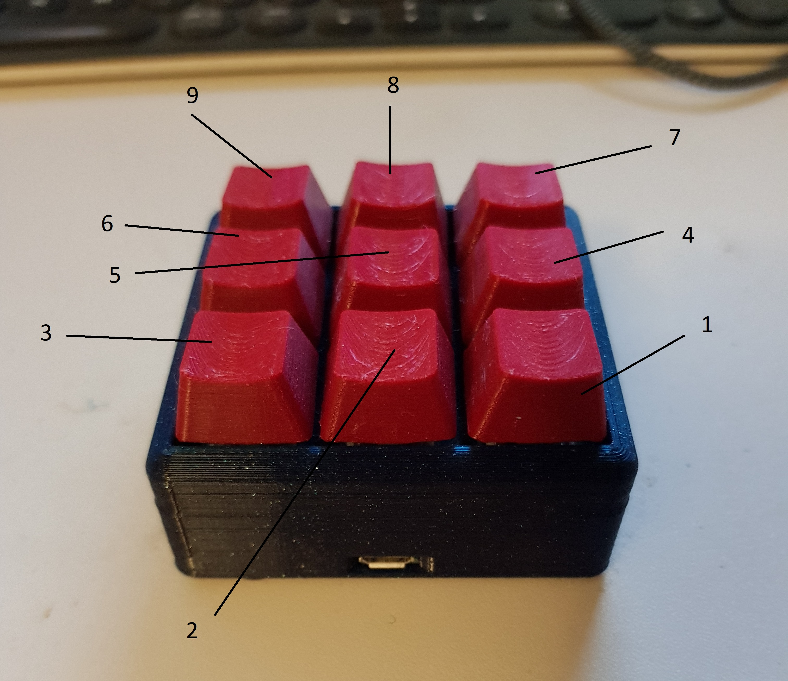
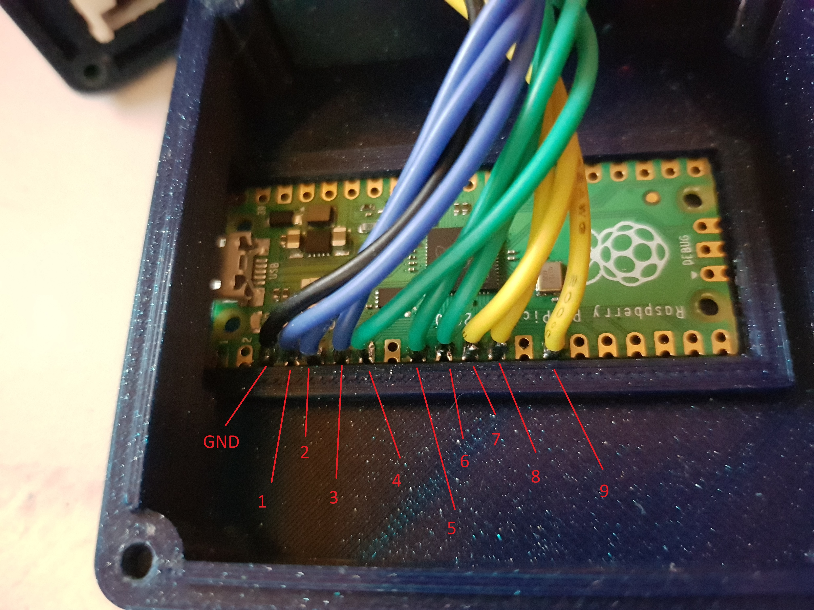
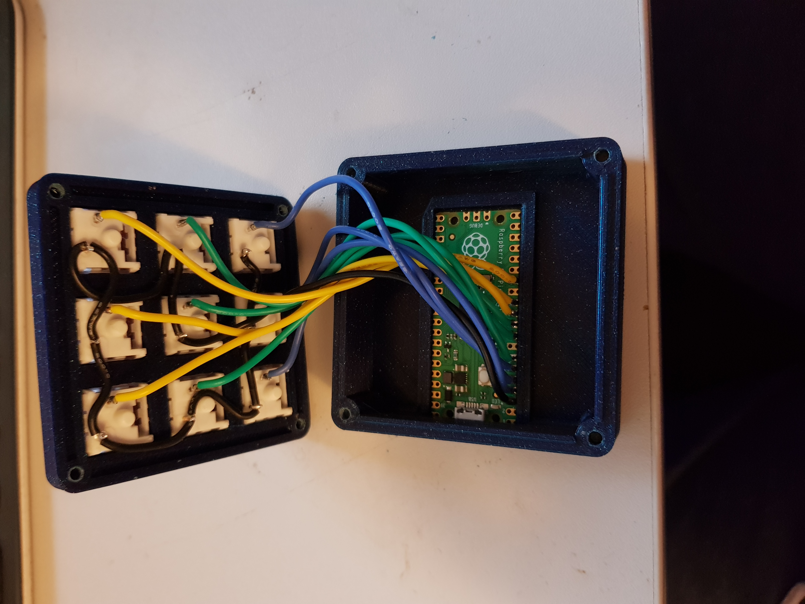

# RP-Macropad - A Raspberry Pi Pico Macropad

## Description

After reading [JimDawson's](https://blog.jmdawson.co.uk/raspberry-pi-pico-macro-pad/) writeup on how he built a 3x3 macropad based around the Pi Pico. I decided to give it a go myself, but I found whilst there were numerous resources on how to set one up using Circuit python, there weren't any C based implementations. This was a problem for me as I found that the Pi Pico shows up as a usb flash device for programming, however I wanted something that would be plug-n-play with no additional drives showing up.

This uses a modified version of the USBKeyboard class provded as a part of the [ArduinoCore-mbed](https://github.com/arduino/ArduinoCore-mbed/blob/master/libraries/USBHID/src/USBKeyboard.cpp) project. This has been modified to include support for pressing keys not present on standard keyboards (F13-F24). This way the pad can be used for hotkeys without interfering with any others.

## Required Resources

* 3D Print of the 3x3 macropad from V0ID from thingyverse https://www.thingiverse.com/thing:4222157
* 9 x Keycaps, These can be ny "MX" fitting keycaps, you can buy blank ones from aliexpress, but I used these parametric keycaps from rsheldiii on thingiverse https://www.thingiverse.com/thing:2783650
* 9 "MX" style mechanical key switches, I just got mine from ebay https://www.ebay.co.uk/itm/203659785118
* 4 x M3 10mm Bolts to hold frame together.
* 4 X Rubber feet (Optional)
* 1 x Raspberry Pi Pico (3d print is designed to fit this board but any rp2040 based board should work in theory)
* 1 x Micro USB cable (This is required for programming)
* Some wire to wire up all the switches (I used 22AWG silicone wire I had lying around)
* Solder and soldering iron. 
* Visual Studio Code with the PlatformIO extension installed.

### First Time setup
1. If you haven't already, download and install the Arduino IDE from [here](https://www.arduino.cc/en/software)
2. To add support for the Pi Pico, go to "Tools > Board > Board Manager..."
3. Search for RP2040, and install the latest version marked "Arduino Mbed OS RP2040 Boards" Note: Make sure you don't select the deprecated version. 

4. Continue through the installation and click yes on any drivers that it wants to install.
5. Hold the BOOTSEL button whilst plugging in the Pico (you can let go once it's in), you should see a drive get mounted with this inside: 
6. Open Device Manager, you should see the Pico appear as RP2 Target under USB Serial Bus Devices. If you can't the drivers are probably not installed correctly. If you have a Yellow triangle instead, you can try manually selecting the drivers by selecting "Right Click > Update Drivers > Browse My Computer for drivers > Let me pick from a list" and selecting a different option.
7. At this point I reccomend attempting to downolad the Blink example project (make sure you select the correct Board and COM Port from the arduino IDE)

From now on you will not need to press the BOOTSEL when plugging in the device, if your PC has the correct drivers it will show up as a serial port in device manager.

## Software Build Instructions

1. Clone https://github.com/WillBeasley/RP-Macropad.git to a local folder
2. Open the folder within VS code
3. Run Build PLatformIO option. It should handle getting dependancies.

## Hardware Build Instructions

1. 3D print V0ID's 3x3 print
2. Snap the keyswitches into the array, I chose to put the LED channel at the to (usb port) side
3. Solder 1 leg of each of the switches together (This will be the GND connection)

4. Solder 1 wire to each of the other legs on the switch (This will go to the GPIO on the Pi Pico)
5. Solder each switch to the Pico GP2-GP10 The pictures below show how each switch maps to each input. (Note: In the left picture the keypad is upside down to give port as reference).

Once that is done you should have something that looks like this:

6. After making sure you have completed the First Time Setup, you should be OK to close the lid and secure it with the M3 bolts.
7. Add your keycaps!

## Special Thanks

* V0ID and rsheldiii for their excellent 3D designs show them some love [here](https://www.thingiverse.com/v0ld/designs) and [here](https://www.thingiverse.com/rsheldiii/designs)

* [PlatformIO Team](https://platformio.org/)
* [James Dawson](https://blog.jmdawson.co.uk/raspberry-pi-pico-macro-pad/) For the inspiration for this project.
